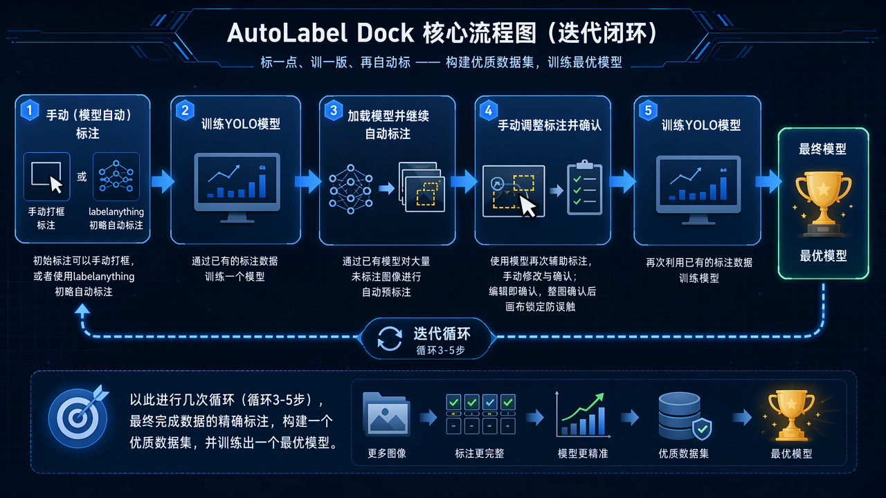
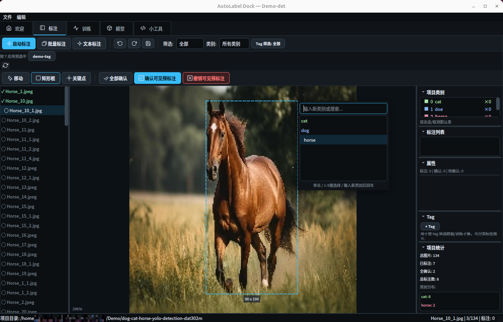
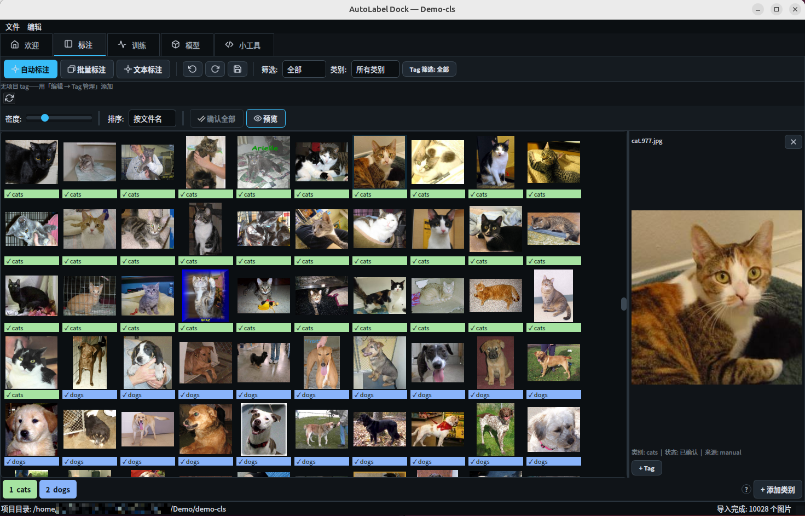
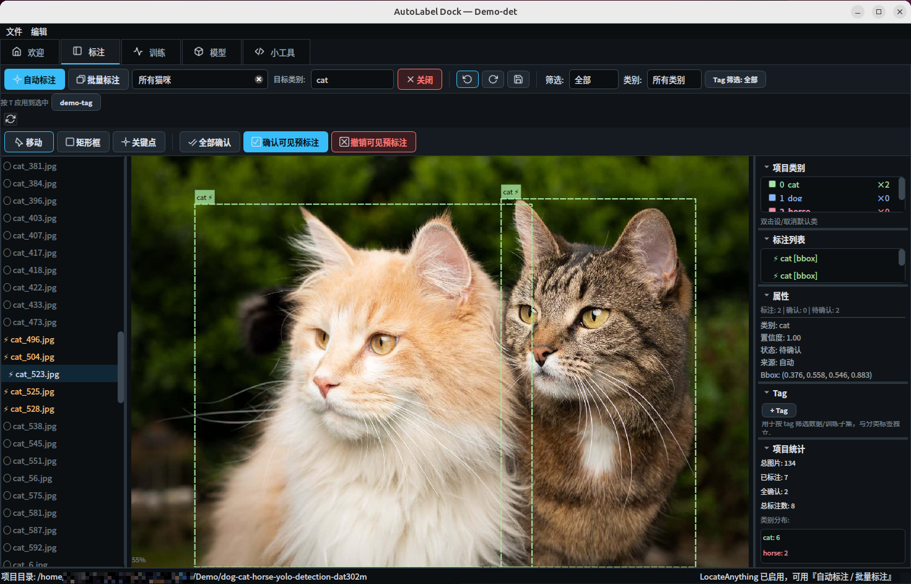
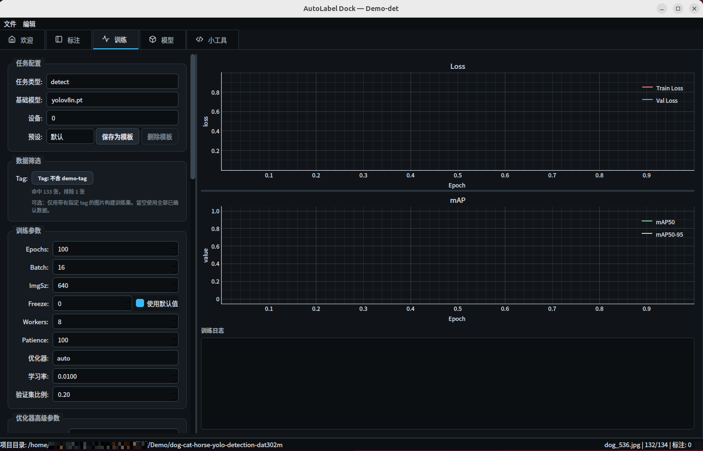
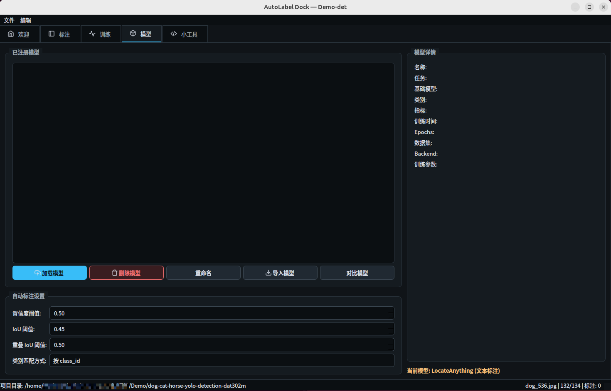

# AutoLabel Dock

> 标一点、训一版、再自动标 —— 桌面端图像标注与 YOLO 训练的迭代闭环工具。


[English](README_EN.md) | **简体中文**


AutoLabel Dock 是一款基于 **PyQt5 + Ultralytics** 的桌面端图像标注工具，全中文界面，跨 Linux / macOS / Windows 运行。

它把"标注"与"训练"做成一个迭代闭环：先手动（或用现有模型辅助）标注一批图，人工确认后一键训练自定义 YOLO 模型，再用新模型继续自动标注剩余数据——每迭代一轮，需要手动修正的越来越少。




<details>
<summary><b>界面截图</b></summary>

| 面板 | 界面展示 |
|:---|:---:|
| 标注（检测/关键点） |  |
| 分类 |  |
| LocateAnything |  |
| 训练面板 |  |
| 模型面板 |  |

</details>

---

## ✨ 功能特性

- **三种任务类型** — 目标检测（边界框）、姿态估计（边界框 + 关键点骨架）、图像分类（整图标签，按 `1`–`9` 秒标，标完自动跳下一张）。
- **键盘流手工标注** — `W` 画框、`K` 打点、`A`/`D` 切图、`Space` 确认；拖拽移动/缩放、滚轮缩放平移；每张图独立撤销栈，切图自动保存。
- **模型辅助标注** — 加载任意 YOLOv8 权重，对单图或全项目批量预标注。预标注以黄色虚线的「待确认」状态呈现，人工确认后才算数；与已确认标注重叠的预测会按 IoU 自动去重。
- **文本提示标注（可选）** — 集成 NVIDIA LocateAnything-3B 开放词汇检测，用自然语言描述目标（如「红色安全帽」）即可预标注，不需要预先训练。模型运行在独立子进程中，显存自动管理，关闭即释放。（见「[可选：LocateAnything 文本标注](#可选locateanything-文本标注)」）
- **内置训练** — 从已确认标注一键生成 YOLO 格式数据集（分层抽样切分 train/val），提供参数预设、数据增强预览、实时 loss/mAP 曲线；训练完成自动注册模型并加载，可立即投入下一轮标注。符号链接零拷贝（Windows 自动降级，见[平台说明](#平台说明)）
- **数据集管理** — 文件列表按标注状态着色，状态 / 类别 / 标签三重筛选；给图片打自定义 tag，训练时按 tag 圈定子集；关键操作前自动备份，可随时回滚。
- **模型管理** — 模型注册表、多模型指标对比、模型结构查看器（逐层参数量与输出尺寸，辅助选择冻结层数 `freeze`）、导入外部 `.pt`。
- **小工具面板** — 应用内直接编写并运行 Python 脚本（工作目录为当前项目），批量改名、数据清洗等杂活不用切出去。

---

## 🚀 快速开始

### 环境要求

- Python ≥ 3.10
- 训练与推理建议使用 NVIDIA GPU（纯 CPU 也能运行，速度受限）
- 文本提示标注需要显存 ≥ 6GB 的 NVIDIA GPU

### 安装与运行

```bash
git clone https://github.com/xzcGit/autolabel-dock.git
cd autolabel-dock

# 建议使用独立环境
conda create -n autolabel python=3.10 -y
conda activate autolabel

pip install -r requirements.txt
python main.py
```

> 💡 需要 GPU 训练时，请先按 [PyTorch 官网](https://pytorch.org/get-started/locally/)指引安装与本机 CUDA 匹配的 torch，再安装其余依赖。
> 训练底模（如 `yolov8n.pt`）首次使用时由 Ultralytics 自动下载，离线环境请提前下载放到仓库根目录。

## （可选）：LocateAnything 文本标注

LocateAnything-3B 是可选的开放词汇检测后端，用自然语言描述要标注的目标。不启用它时应用其余功能完全正常。启用需同时满足以下三个条件，任一不满足时界面会给出中文提示，不影响应用本身：

<details>
<summary><b>查看详情</b></summary>

**1. 安装可选依赖**

```bash
pip install -e ".[locateanything]"
```

会额外安装 transformers、accelerate、bitsandbytes、decord（基础安装不包含这些重依赖）。

**2. 提前下载模型权重**

运行时以离线模式（`HF_HUB_OFFLINE=1`）加载，**不会自动下载**，必须提前手动下载 `nvidia/LocateAnything-3B` 到本地 HuggingFace 缓存：

```bash
hf download nvidia/LocateAnything-3B
# 旧版工具：huggingface-cli download nvidia/LocateAnything-3B
```

默认缓存位置为 `~/.cache/huggingface/hub`，也支持通过 `$HF_HOME` 或 `$HUGGINGFACE_HUB_CACHE` 指定。

**3. GPU 显存**

需要 NVIDIA GPU 且 `nvidia-smi` 可用，**不支持 CPU 运行**；总显存 ≥ 6GB，且启用时空闲显存 ≥ 5GB（单卡机器上桌面显示也占用显存，故空闲门槛较高）。

> 另外：LocateAnything 与 YOLO 模型不会同时占用 GPU——启用 LocateAnything 会自动卸载已加载的 YOLO 模型，反向（加载 YOLO 模型或开始训练）会先弹窗确认关闭 LocateAnything。它运行在独立子进程中，与主界面进程隔离。

</details>

---

## 📖 基本工作流

```
1. 创建项目  →  2. 导入图片  →  3. 标注  →  4. 确认  →  5. 训练  →  6. 迭代 ↻
```

1. **创建项目**：选择任务类型（检测 / 姿态 / 分类），指定项目目录（项目会自动扫描加载images/labels），或留空后通过下一步拖入
2. **导入图片**：直接拖进窗口（也可后续放入项目 `images/` 目录后刷新列表）；已有标注可经 `Ctrl+I` 从 YOLO / COCO / labelme 格式导入
3. **标注**：手动绘制；或加载一个 YOLO 权重做自动预标注；也可选用 LocateAnything 文本标注后端，用自然语言描述要标注的目标（见[可选：LocateAnything 文本标注](#可选locateanything-文本标注)）
4. **确认**：逐图检查自动标注结果，编辑即确认
5. **训练**：训练页选择底模与参数（或直接用预设）→ 开始训练 → 曲线实时更新，完成后模型自动注册并加载
6. **迭代**：用新模型继续自动标注 → 确认 → 再训练，直到满意为止。

## ⌨️ 快捷键

| 场景 | 快捷键 | 功能 |
|:---:|:---|:---|
| 通用 | <kbd>Ctrl</kbd>+<kbd>Z</kbd> / <kbd>Ctrl</kbd>+<kbd>Y</kbd> | 撤销 / 重做（每张图独立） |
| 通用 | <kbd>Ctrl</kbd>+<kbd>S</kbd> | 保存全部修改 |
| 通用 | <kbd>Shift</kbd>+<kbd>A</kbd> / <kbd>Ctrl</kbd>+<kbd>Shift</kbd>+<kbd>A</kbd> | 单图自动标注 / 批量自动标注 |
| 通用 | <kbd>T</kbd> | 给选中图片批量添加已装载的 tag |
| 通用 | <kbd>F5</kbd> | 重新扫描图片目录 |
| 检测/姿态 | <kbd>W</kbd> / <kbd>K</kbd> / <kbd>V</kbd> | 画框 / 关键点 / 选择工具 |
| 检测/姿态 | <kbd>A</kbd>・<kbd>←</kbd> / <kbd>D</kbd>・<kbd>→</kbd> | 上一张 / 下一张（自动保存） |
| 检测/姿态 | <kbd>Space</kbd> / <kbd>Ctrl</kbd>+<kbd>Space</kbd> | 确认选中标注 / 确认本图全部 |
| 检测/姿态 | <kbd>Delete</kbd> | 删除选中标注 |
| 检测/姿态 | <kbd>Ctrl</kbd>+<kbd>C</kbd> / <kbd>Ctrl</kbd>+<kbd>V</kbd> | 复制 / 粘贴标注 |
| 检测/姿态 | <kbd>Ctrl</kbd>+<kbd>=</kbd> / <kbd>Ctrl</kbd>+<kbd>-</kbd> / <kbd>Ctrl</kbd>+<kbd>0</kbd> | 放大 / 缩小 / 适应窗口 |
| 分类 | <kbd>1</kbd>–<kbd>9</kbd> | 选择类别并跳到下一张 |
| 分类 | <kbd>Delete</kbd> / <kbd>Backspace</kbd> | 清除选中图片的标签 |

## 🔄 导入 / 导出

| 格式 | 导入 | 导出 | 适用任务 |
|:---|:---:|:---:|:---|
| YOLO（txt） | ✅ | ✅ | 检测 / 姿态 |
| COCO（json） | ✅ | ✅ | 检测 / 姿态 |
| labelme（json） | ✅ | ✅ | 检测 / 姿态 |
| ImageFolder（按类别分文件夹） | ✅ | ✅ | 分类 |
| CSV（标注汇总表） | — | ✅ | 全部 |

---

## 平台说明

训练数据集准备会创建大量"指向原图"的链接。代码（`src/utils/fs.py` 的 `link_or_copy`）按以下优先级自动降级，保证在任何平台都能运行：

```
symlink（符号链接） → hardlink（硬链接） → copy（复制）
```

| 方式 | 触发条件 | 速度 | 额外占用 |
|:---|:---|:---:|:---:|
| symlink | 系统支持且有权限（Linux/macOS 默认；Windows 需开发者模式或管理员） | 最快 | 几乎为零 |
| hardlink | symlink 失败，且源与目标在同一磁盘卷（Windows NTFS 无需特权） | 最快 | 几乎为零 |
| copy | 前两者均失败（典型：跨盘 + 非开发者模式） | 慢 | 与图片总大小相同 |

> ⚠️ **Windows 推荐**：启用开发者模式（设置 → 隐私和安全 → 开发者选项），一次设置永久生效，行为与 Linux 一致；或保证项目目录与图片目录在同一磁盘（自动走硬链接路径）。
>
> **其他注意**：建议项目路径使用纯英文；若把图片目录指向另一块磁盘（跨盘），链接会退化为复制，占用额外磁盘空间。

---
## 📁 项目数据结构

每个标注项目就是一个普通文件夹，标注数据是人类可读的 JSON，方便脚本二次处理：

```
my_project/
├── project.json          # 项目配置：任务类型、类别、tag 注册表
├── images/               # 图片（也可配置为指向外部目录）
├── labels/               # 每张图一个 JSON 标注文件
│   └── img_001.json
├── models/
│   ├── registry.json     # 已注册模型的元数据
│   └── detect-.../weights/best.pt
├── datasets/current/     # 训练时自动生成的 YOLO 数据集（符号链接，不复制图片）
└── .backups/             # 自动备份快照（保留最近 20 份）
```

坐标约定：所有标注坐标归一化到 `[0,1]`，边界框为中心点格式 `(cx, cy, w, h)`，与 YOLO 格式一致。

应用全局配置与日志位于 `~/.autolabel/`。

---

## 📄 许可证

本项目以 **[AGPL-3.0](LICENSE)** 许可证发布。

> 项目的核心依赖采用强 copyleft 许可：
>
> - **PyQt5** — GPL-3.0
> - **Ultralytics (YOLOv8)** — AGPL-3.0
>
> 依赖中最严格的是 AGPL-3.0，本项目据此对齐。若需在闭源/商业产品中使用，请自行获取相应依赖的商业授权（PyQt 商业授权、Ultralytics 企业授权）。

